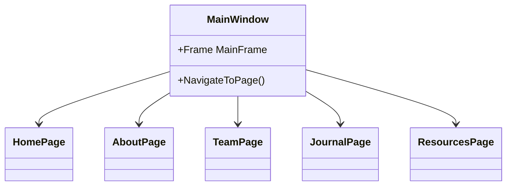

# Отчёт о проектной практике
**"Система централизованной отчётности и предикативная модель операционных показателей для Московского Политеха (I курс)"**  


---

## 1. Обзор проекта
**Цель:** Создание информационного портала для системы централизованной отчётности с функциями:
- Представление информации о проекте
- Демонстрация участников и их вклада
- Отображение хода работ
- Предоставление полезных ресурсов

## 2. Архитектура приложения
```markdown


## 3. Реализованные компоненты

### 3.1 Основное окно (MainWindow.xaml)

**Структура:**

```markdown
```xml
<Grid>
  <Grid.RowDefinitions>
    <!-- Header -->
    <!-- Navigation + Content -->
    <!-- Footer -->
  </Grid.RowDefinitions>
</Grid>
```

**Функционал:**

-Навигационное меню с 5 кнопками
-Область для отображения контента (Frame)
-Автоматическая загрузка HomePage при старте

### 3.2 Страницы приложения
**Главная страница (HomePage.xaml)**
-Аннотация проекта
-Основные возможности системы
-Изображение-превью проекта

**Страница "О проекте" (AboutPage.xaml)**
-Цели и задачи
-Функционал системы
-Используемый технологический стек

**Страница участников (TeamPage.xaml)**
-Информация о каждом участнике

**Журнал проекта (JournalPage.xaml)**
-Хронология работ

**Ресурсы (ResourcesPage.xaml)**
-Полезные ссылки: Лк Мосполитех, YandexdataLens, Github

## 4. Технические особенности

### 4.1 Стилизация
```markdown
```xml
<Style x:Key="NavButtonStyle" TargetType="Button">
  <Setter Property="Foreground" Value="White"/>
  <Style.Triggers>
    <Trigger Property="IsMouseOver" Value="True">
      <Setter Property="Background" Value="#2C3E50"/>
    </Trigger>
  </Style.Triggers>
</Style>
```
### 4.2 Навигация
```markdown
```cs
private void NavButton_Click(object sender, RoutedEventArgs e)
{
    switch (((Button)sender).Name)
    {
        case "btnHome": MainFrame.Navigate(new HomePage()); break;
        // ... другие страницы
    }
}
```

## 5. Взаимодействие с организацией-партнёром:

-Мастер-класс «Требования и их важность при разработке ПО» от компании ООО "Эдит Про"
-Мастер-класса "Как мы развиваем ИТ-продукты для госсектора. Опыт НИИ "МосТрансПроект""
